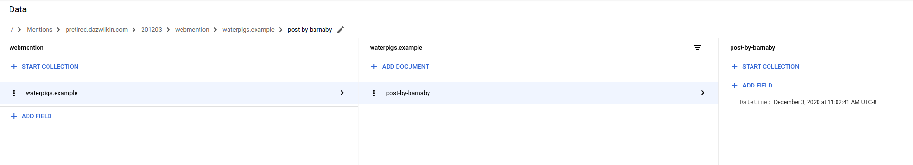

# webmention

+ [](https://goreportcard.com/report/github.com/DazWilkin/webmention)
+ [](https://pkg.go.dev/DazWilkin/webmention)

## Example POST

```console
POST /webmention-endpoint HTTP/1.1
Host: aaronpk.example
Content-Type: application/x-www-form-urlencoded

source=https://waterpigs.example/post-by-barnaby
target=https://aaronpk.example/post-by-aaron


HTTP/1.1 202 Accepted
```


## Run

```bash
go run ./cmd
2020/12/03 09:29:34 Listening [:8080]
```

And then POST something to it:

```bash
SOURCE="https://waterpigs.example/post-by-barnaby"
TARGET="https://pretired.dazwilkin.com/posts/201203"

curl \
--request POST \
--header "content-type:application/json" \
--header "source:${SOURCE}" \
--header "target:${TARGET}" \
localhost:8080/webmention
```

Yields:

```console
2020/12/03 09:29:37 [Webmention]: Content-Type: [application/json]
2020/12/03 09:29:37 [Webmention]: Host: []
2020/12/03 09:29:37 [Webmention]: source: [https://waterpigs.example/post-by-barnaby]
2020/12/03 09:29:37 [Webmention]: target: [https://pretired.dazwilkin.com/201204/test]
```

> **NOTE** Headers are capitalized `content-type` --> `Content-Type`

Generates 400s if `source` and `target` are not provided:

```bash
curl \
--request POST \
--header "content-type:application/json" \
--header "source:${SOURCE}" \
--write-out "%{response_code}"
Bad request: Source and Target headers required
400
```


## GCP

### Create

```bash
PROJECT="webmention"
BILLING=$(gcloud alpha billing accounts list --format="value(name)")
gcloud beta billing projects link ${PROJECT} --billing-account=${BILLING}

for SERVICE in "cloudfunctions" "cloudbuild"
do
  gcloud services enable ${SERVICE}.googleapis.com --project=${PROJECT}
done
```

Create Firestore


### Test

```bash
ROBOT="[[YOUR-ROBOT]]"

gcloud iam service-accounts create ${ROBOT} \
--project=${PROJECT}

gcloud projects add-iam-policy-binding ${PROJECT} \
--member=serviceAccount:${ROBOT}@${PROJECT}.iam.gserviceaccount.com \
--role=roles/datastore.user

# This step is only needed if you wish to test locally
gcloud iam service-accounts keys create ${PWD}/${ROBOT}.json \
--iam-account=${ROBOT}@${PROJECT}.iam.gserviceaccount.com \
--project=${PROJECT}
```

Then:

```bash
export GOOGLE_APPLICATION_CREDENTIALS=${PWD}/${ROBOT}.json
export GOOGLE_CLOUD_PROJECT=${PROJECT}
go run ./cmd
```

Then POST an example and:



## Deploy

The repo's `.gcloudignore` will ensure that only `go.mod`, `go.sum` and `function.go` are deployed.

```bash
FUNCTION="[[YOUR-PROJECT]]"
ROBOT="[[YOUR-ROBOT]]"

REGION="us-central1"

gcloud functions deploy ${FUNCTION} \
--region=${REGION} \
--allow-unauthenticated \
--entry-point=Webmention \
--max-instances=1 \
--runtime=go113 \
--service-account=${ROBOT}@${PROJECT}.iam.gserviceaccount.com \
--source=. \
--update-labels=project=webmention,language=golang \
--trigger-http \
--project=${PROJECT} \
--set-env-vars=GOOGLE_CLOUD_PROJECT=${PROJECT}
```

> **NOTE** The Firestore API appears unable to detect the ProjectID so, the value is passed through the environment (`GOOGLE_CLOUD_PROJECT`)

Then:

```bash
URL=$(\
  gcloud functions describe ${FUNCTION} \
  --project=${PROJECT}
  --format="value(httpsTrigger.url)")

SOURCE="https://waterpigs.example/post-by-barnaby"
TARGET="https://pretired.dazwilkin.com/posts/201203"

curl \
--request POST \
--header "content-type:application/json" \
--header "source:${SOURCE}" \
--header "target:${TARGET}" \
${URL}
```

> **NOTE** Only first occurrence is recorded; thereafter `Create` will error. This makes sense, as the first mention is the only relevant mention.

